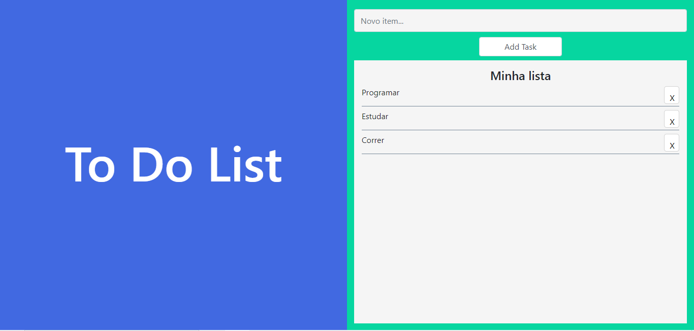

<h1 align="center">📜</h1>
<h1 align="center">To - Do - List</h1>
<div align="center"></div>

<hr>

### 📚 Sobre

To-Do-List é uma lista de tarefas feita em JavaScript para a fixação de conteúdo.

### 🎨 Detalhe

Estilização feita com Bootstrap e Css, se comportando de modo responsivo.

<hr>

### 🔥 Como contribuir

```
Fork este respositório
Faça as mudanças
Abra um pull request
```

### 💻 Tecnologias utilizadas

Nesta Lista de Tarefas feita em JavaScript foram utilizadas as seguintes tecnologias

- [HTML](https://www.w3schools.com/html/)
- [CSS](https://www.w3schools.com/css/)
- [Bootstrap](https://getbootstrap.com/)
- [JavaScript](https://www.w3schools.com/js/)

### :airplane: Acesse o projeto

Hospedado no Netlify

https://to-do-list-gsj.netlify.app/
